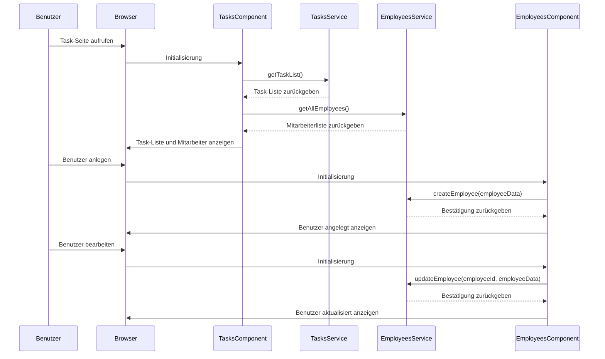

```mermaid
sequenceDiagram
    participant Benutzer
    participant Browser
    participant TasksComponent
    participant TasksService
    participant EmployeesService

    Benutzer->>Browser: Task-Seite aufrufen
    Browser->>TasksComponent: Initialisierung
    TasksComponent->>TasksService: getTaskList()
    TasksService-->>TasksComponent: Task-Liste zurückgeben
    TasksComponent->>EmployeesService: getAllEmployees()
    EmployeesService-->>TasksComponent: Mitarbeiterliste zurückgeben
    TasksComponent->>Browser: Task-Liste und Mitarbeiter anzeigen

    Benutzer->>Browser: Benutzer anlegen
    Browser->>EmployeesComponent: Initialisierung
    EmployeesComponent->>EmployeesService: createEmployee(employeeData)
    EmployeesService-->>EmployeesComponent: Bestätigung zurückgeben
    EmployeesComponent->>Browser: Benutzer angelegt anzeigen

    Benutzer->>Browser: Benutzer bearbeiten
    Browser->>EmployeesComponent: Initialisierung
    EmployeesComponent->>EmployeesService: updateEmployee(employeeId, employeeData)
    EmployeesService-->>EmployeesComponent: Bestätigung zurückgeben
    EmployeesComponent->>Browser: Benutzer aktualisiert anzeigen
```
